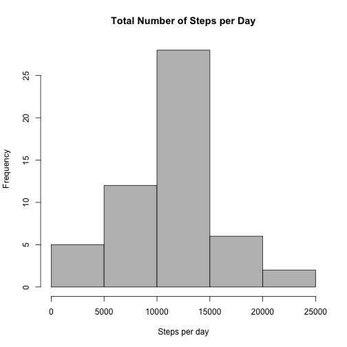
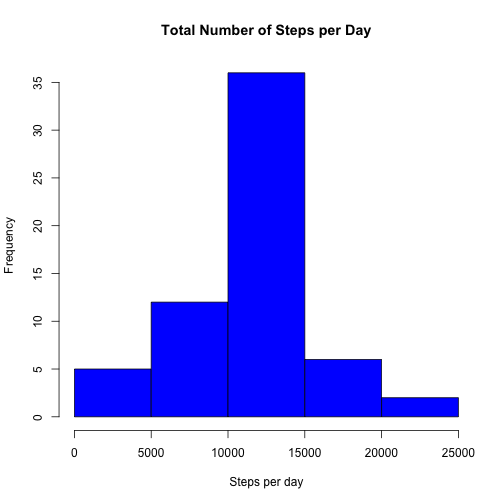

**Prerequisites**     
A) I downloaded the data (activity.csv) given in the assignment's description on coursera to my working directory

Dataset: Activity monitoring data [52K] (activity.csv)     
The variables included in this dataset are:      
- steps: Number of steps taking in a 5-minute interval (missing values are coded as NA)     
- date: The date on which the measurement was taken in YYYY-MM-DD format      
- interval: Identifier for the 5-minute interval in which measurement was taken    

B) Load the following libraries / install the corresponding packages       

library(knitr)     
library(ggplot2)        
library(lubridate)      
library(plyr)     
library(dplyr)   
library(lattice)    

C) some global chunk options

```r
knitr::opts_chunk$set(fig.path='Figures/')
```

# Loading and preprocessing the data    
Show any code that is needed to     
- Load the data (i.e. read.csv())         
- Process/transform the data (if necessary) into a format suitable for your analysis       

**reading data and familiarizing with it**    

```r
activity <- read.csv("activity.csv", header = TRUE, colClasses = c("numeric", "character","integer")) #reading data       
head(activity) #return the first part of activity data       
```

```
##   steps       date interval
## 1    NA 2012-10-01        0
## 2    NA 2012-10-01        5
## 3    NA 2012-10-01       10
## 4    NA 2012-10-01       15
## 5    NA 2012-10-01       20
## 6    NA 2012-10-01       25
```

```r
str(activity) #display structure of activity data        
```

```
## 'data.frame':	17568 obs. of  3 variables:
##  $ steps   : num  NA NA NA NA NA NA NA NA NA NA ...
##  $ date    : chr  "2012-10-01" "2012-10-01" "2012-10-01" "2012-10-01" ...
##  $ interval: int  0 5 10 15 20 25 30 35 40 45 ...
```

```r
summary(activity) #produce result summary of activity data        
```

```
##      steps            date              interval     
##  Min.   :  0.00   Length:17568       Min.   :   0.0  
##  1st Qu.:  0.00   Class :character   1st Qu.: 588.8  
##  Median :  0.00   Mode  :character   Median :1177.5  
##  Mean   : 37.38                      Mean   :1177.5  
##  3rd Qu.: 12.00                      3rd Qu.:1766.2  
##  Max.   :806.00                      Max.   :2355.0  
##  NA's   :2304
```

**convert date to calender date**

```r
activity$date <- as.Date(activity$date, "%Y-%m-%d")
```

**subset complete values and define structure of date**     
Getting rid of NAs as requested in some of the tasks below

```r
komplett <- subset(activity, complete.cases(activity))  
```


# What is mean total number of steps taken per day?    

For this part of the assignment, ignore the missing values in the dataset.    
- Make a histogram of the total number of steps taken each day  
- Calculate and report the mean and median total number of steps taken per day   

**split activity data per date**   

```r
steps.day<-split(komplett,komplett$date, drop=TRUE)            
```

**daily sum of steps**     

```r
sum.stepsdaily <-sapply(steps.day, function(x) sum(x$steps))    
```

**plotting the histogram**    

```r
hist(sum.stepsdaily, main="Total Number of Steps per Day", xlab= "Steps per day", col="grey")    
```

 

**calculating and return mean and median**      

```r
summary(sum.stepsdaily)  
```

```
##    Min. 1st Qu.  Median    Mean 3rd Qu.    Max. 
##      41    8841   10760   10770   13290   21190
```

```r
mean(sum.stepsdaily)
```

```
## [1] 10766.19
```

```r
median(sum.stepsdaily)
```

```
## [1] 10765
```

# What is the average daily activity pattern?

Make a time series plot (i.e. type = "l") of the 5-minute interval (x-axis) and the average number of steps taken, averaged across all days (y-axis)        
Which 5-minute interval, on average across all the days in the dataset, contains the maximum number of steps?       

**split data per interval**      

```r
intervall <- split(komplett,komplett$interval, drop=TRUE)    
```

**average steps per interval**

```r
avg.intervall <- sapply(intervall, function(x) mean(x$steps))    
```

**plotting**

```r
plot(avg.intervall, type="l", main="5' Interval Time", 
ylab="Average Number of Steps", xlab="Interval", col="magenta")                 
```

 
 
**finding the interval out of avg.interval with maximum number of steps**    

```r
which.max(avg.intervall) # returning interval and index
```

```
## 835 
## 104
```

```r
round(max(avg.intervall)) # maximum average number of steps
```

```
## [1] 206
```

# Imputing missing values

Note that there are a number of days/intervals where there are missing values     (coded as NA). The presence of missing days may introduce bias into some     calculations or summaries of the data.    

- Calculate and report the total number of missing values in the dataset    
(i.e. the total number of rows with NAs)       

- Devise a strategy for filling in all of the missing values in the dataset.     
The strategy does not need to be sophisticated. For example, you could use the      mean/median for that day, or the mean for that 5-minute interval, etc.   

- Create a new dataset that is equal to the original dataset but with the missing data filled in.    

- Make a histogram of the total number of steps taken each day and Calculate and    report the mean and median total number of steps taken per day. Do these values    differ from the estimates from the first part of the assignment? What is the    impact of imputing missing data on the estimates of the total daily number of steps?    

**how many NAs**

```r
sum(is.na(activity))
```

```
## [1] 2304
```

**filling in NAs with mean of 5 min interval**

```r
mean.stepint <- aggregate(steps ~ interval, data = activity, FUN = mean) # creating vector of mean steps per interval
kompl<- numeric() # creating empty numeric vector 
# fill in NAs with values of mean.stepint if NA, else use original value and save it into vector 'kompl'
for (i in 1:17568) {
  nas <- activity[i, ]
  if(is.na(nas$steps)) {
    steps <- subset(mean.stepint, interval == nas$interval)$steps
  } else {
    steps <- nas$steps
  }
  kompl <- c(kompl, steps)
}
```

**create new dataset equal the original dataset, but with filled in NAs**

```r
new.data <- activity
new.data$steps <- kompl
head(new.data) #cross check
```

```
##       steps       date interval
## 1 1.7169811 2012-10-01        0
## 2 0.3396226 2012-10-01        5
## 3 0.1320755 2012-10-01       10
## 4 0.1509434 2012-10-01       15
## 5 0.0754717 2012-10-01       20
## 6 2.0943396 2012-10-01       25
```

**split new activity data per date**   

```r
steps.day2 <- split(new.data,new.data$date, drop=TRUE)            
```

**daily sum of steps**     

```r
sum.stepsdaily2 <-sapply(steps.day2, function(x) sum(x$steps))    
```

**plotting the histogram**    

```r
hist(sum.stepsdaily2, main="Total Number of Steps per Day", xlab= "Steps per day", col="blue")    
```

 

**calculating and return mean and median**

```r
summary(sum.stepsdaily2)  
```

```
##    Min. 1st Qu.  Median    Mean 3rd Qu.    Max. 
##      41    9819   10770   10770   12810   21190
```

```r
mean(sum.stepsdaily2)
```

```
## [1] 10766.19
```

```r
median(sum.stepsdaily2)
```

```
## [1] 10766.19
```

**There's no big difference between mean and median.**        
**The frequency (i.e. number of observations) is different (no NAs in new activity dataset).**


# Are there differences in activity patterns between weekdays and weekends?

For this part the weekdays() function may be of some help here. Use the dataset with the filled-in missing values (in my case = new.data) for this part.    

- Create a new factor variable in the dataset with two levels -- "weekday" and    "weekend" indicating whether a given date is a weekday or weekend day.   

- Make a panel plot containing a time series plot (i.e. type = "l") of the    5-minute interval (x-axis) and the average number of steps taken, averaged    across all weekday days or weekend days (y-axis).     

**creating new factor variable for weekday or weekend day**

```r
library(plyr)
library(lubridate)
```

```
## 
## Attaching package: 'lubridate'
## 
## The following object is masked from 'package:plyr':
## 
##     here
```

```r
new.data2 <- mutate(new.data, day=as.factor(ifelse(wday(date) %in% c(1,7), "weekend", "weekday")))
```

**make the panel plot comparing weekday versus weekend activity**

```r
avg.intervall2 <- aggregate(new.data2$steps ~ new.data2$interval + new.data2$day, new.data2, mean) #average steps per intervall
names(avg.intervall2) <- c("interval", "day", "steps")
library(lattice)
xyplot(avg.intervall2$steps ~ avg.intervall2$interval | avg.intervall2$day, type= "l", ylab="Average Number of Steps", layout = c(1,2), col="red")
```

 
